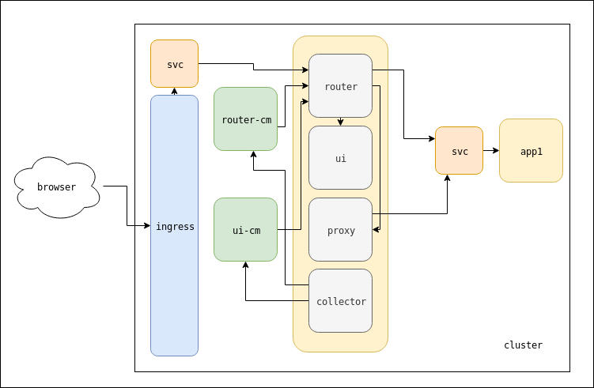

# Kubernetes OpenAPI Spec Collector

[](https://travis-ci.org/dlmiddlecote/openapi-collector)
[](https://coveralls.io/github/dlmiddlecote/openapi-collector?branch=master)

Kubernetes OpenAPI Spec Collector aggregates (collects) all specifications exposed by services inside a Kubernetes Cluster, into a single UI for quick exploration.

By processing annotated `Service`s, the UI is automatically updated with new specifications as they are added or evolve, and is an excellent way to explore APIs.

This project was heavily inspired in style and implementation by [hjacobs/kube-janitor](https://github.com/hjacobs/kube-janitor).

## Design



The OpenAPI Collector Pod consists of 4 containers; `ui`, `router`, `proxy` and `collector`. Two ConfigMaps (one for the ui config, one for the router config) are also required. These ConfigMaps are automatically updated by the `collector` container, which polls the Kubernetes API to find Services exposing OpenAPI Specs.

*Containers*

- `ui`

	This is a plain swagger-ui container, that is configured to retrieve its configuration from a local `/swagger-config.json` endpoint (served by the router). This UI should be accessed via the router.

- `router`

	This container is one half of the brain of the OpenAPI Collector. It is powered by nginx and all requests flow through this. Requests are then fanned out accordingly to either the ui, proxy or backend services directly.

- `proxy`

	This container is a small Flask application that augments the OpenAPI spec that is collected, to insert a new, fake, server that will be used to route requests correctly via the router.

- `collector`

	This container is the other half of the brain of the OpenAPI Collector, and polls the Kubernetes API looking for Services that expose OpenAPI Specs. These found Services are then used to update the ui and router configuration.

## Usage

Deploy the collector into your cluster:
```
$ kubectl apply -f deploy/
```

To see the collector in action, deploy an app that exposes an OpenAPI spec, and annotate the service that points to the app. 
```
$ # deploy app
$ kubectl annotate service app openapi/collect=true
$ kubectl annotate service app openapi/port=80  # port name or number that the spec is accessible at
$ kubectl annotate service app openapi/path=/  # base path of specification
```

You should be able to then connect to the collector Pod and see the specification in the UI. NOTE: This may take some time to appear, dependent on the poll interval of the collector, and also [the Kubelet sync period](https://kubernetes.io/docs/tasks/configure-pod-container/configure-pod-configmap/#mounted-configmaps-are-updated-automatically).

## Configuration

The OpenAPI Spec Collector is configured via command line args and Kubernetes annotations.

*Kubernetes Annotations*:

- `openapi/collect`

	Annotate `Service` resource with value `”true”`  to mark the `Service` as one exposing an OpenAPI spec, and one that should be collected. 

- `openapi/port`
	
	Annotate `Service` resource with the port number or name that the OpenAPI spec will be exposed at.

- `openapi/path`
	
	Annotate `Service` resource with the base path of the OpenAPI spec, i.e. use the value `”/“` if the spec is available at `/openapi.json`.

*Command line args*:

- `--debug`
	
	Print more information.

- `--interval`
	
	Loop interval (default 30s).

## Contributing

The best way to contribute is to provide feedback. I’d love to hear what you like and what could be better. PRs and Issues more than welcome!

## Local Development

You can run the collector against your current kubeconfig context like this:
```
$ pip install poetry
$ poetry install
$ poetry run python -m openapi_collector
```

To run tests:
```
$ make test
```

## License

This program is free software: you can redistribute it and/or modify it under the terms of the GNU General Public License as published by the Free Software Foundation, either version 3 of the License, or (at your option) any later version.

This program is distributed in the hope that it will be useful, but WITHOUT ANY WARRANTY; without even the implied warranty of MERCHANTABILITY or FITNESS FOR A PARTICULAR PURPOSE. See the GNU General Public License for more details.

You should have received a copy of the GNU General Public License along with this program. If not, see [http://www.gnu.org/licenses/](http://www.gnu.org/licenses/).
